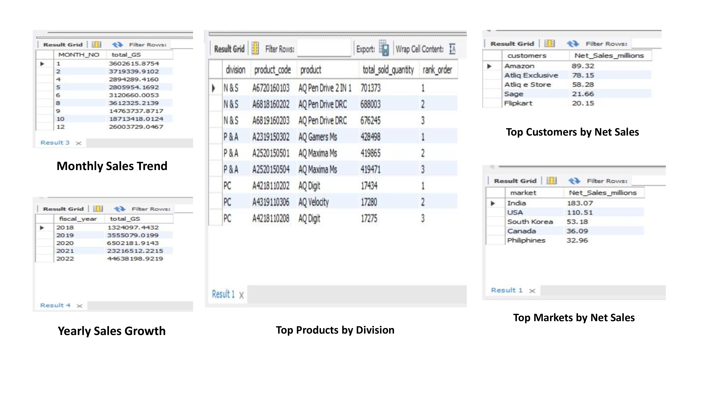

# 📊 Sales & Supply Chain Analytics | SQL Project

A comprehensive **end-to-end SQL-based business analytics project** focused on deriving actionable insights across **sales, financial performance, customer behavior, product performance, and supply chain operations**.

This project simulates real-world business scenarios and demonstrates the ability to **translate raw data into strategic business insights**.

---

## 📌 Business Objective

The objective of this project is to perform **data-driven analysis** to:

- Identify **revenue drivers and growth opportunities**
- Analyze **financial performance and profitability**
- Understand **customer and market contribution**
- Evaluate **product performance across divisions**
- Measure **forecast accuracy in supply chain**

---

## 📊 Project Preview



---

## 🧠 Business Problems Addressed

- How are sales trending monthly and yearly?
- Which customers and markets contribute the most revenue?
- What are the top-performing products by division?
- Which products generate the highest net sales?
- How accurate are demand forecasts?
- What is the contribution of different categories?

---

## 🛠️ Technical Skills Demonstrated

- **SQL (MySQL)**
- Advanced Joins (INNER, LEFT)
- Aggregations (SUM, AVG, COUNT)
- Window Functions (RANK, DENSE_RANK)
- CTEs (Common Table Expressions)
- CASE statements
- Data transformation & business metric calculations

---

## 📊 Analytical Workflow

1. **Data Overview**
   - Market, region, and segment understanding

2. **Sales Analysis**
   - Monthly and yearly sales trends

3. **Financial Analysis**
   - Net sales calculation and P&L insights

4. **Customer & Market Analysis**
   - Top customers and regional contribution

5. **Product Analysis**
   - Product ranking using window functions

6. **Supply Chain Analysis**
   - Forecast error and accuracy measurement

7. **Contribution Analysis**
   - Category-wise contribution insights

---

## 📂 Project Structure

```bash
sales-supply-chain-sql-analysis/

├── SQL_Queries/
│   ├── 01_Data_Overview/
│   ├── 02_Sales_Analysis/
│   ├── 03_Financial_Analysis/
│   ├── 04_Customer_Market_Analysis/
│   ├── 05_Product_Analysis/
│   ├── 06_Supply_Chain_Analysis/
│   └── 07_Contribution_Analysis/
│
├── Outputs/
│   ├── 01_Data_Overview/
│   ├── 02_Sales_Analysis/
│   ├── 03_Financial_Analysis/
│   ├── 04_Customer_Market/
│   ├── 05_Product_Analysis/
│   └── 06_Supply_Chain/
│
├── Presentation/
│   └── AD-HOC_PRESENTATION.pdf
│
└── README.md
```
## 📊 Key Insights

- Identified **top 5 customers contributing highest revenue**
- Determined **market-wise sales performance trends**
- Built a **P&L view for financial performance evaluation**
- Extracted **top 3 products per division using window functions**
- Measured **forecast accuracy for supply chain optimization**

---

## 📁 Outputs

All query outputs are available in the `Outputs` folder.

> ⚠️ Dataset is not included due to data-sharing restrictions.

---

## 🎥 Presentation

A detailed business presentation explaining the analysis and insights:

👉 [View Full Presentation](Presentation/AD-HOC_PRESENTATION.pdf)
---

## 💼 Why This Project Matters

This project demonstrates:

- Strong **SQL problem-solving ability**
- Understanding of **business KPIs and analytics**
- Ability to work with **real-world structured datasets**
- Skill in converting data into **actionable business insights**

---

## 🚀 About Me

I am an aspiring **Data Analyst** actively seeking opportunities in the data industry.

Currently focused on:
- SQL
- Power BI
- Data Analytics & Business Intelligence

---

## 📬 Let’s Connect
## 📬 Let's Connect

**Shubhayan Kundu**  
*Aspiring Data Analyst | SQL • Excel • Power BI • Business Insights*

I am actively looking for entry-level opportunities in **Data Analytics / Business Intelligence**, where I can apply my skills in SQL, data analysis, and problem-solving to drive meaningful insights.

Feel free to connect or reach out:

- 🔗 LinkedIn: https://www.linkedin.com/in/subhayan-kundu/
- 💻 GitHub: https://github.com/your-username  
- 📧 Email: kundusubhayan@gmail.com  

I’m open to opportunities, collaborations, and feedback.

---

## ⭐ Support

If you found this project useful, consider giving it a ⭐
